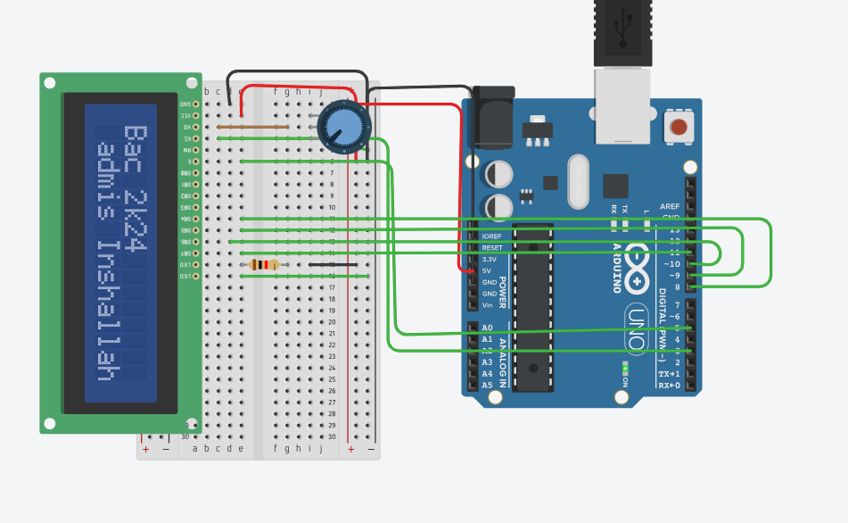
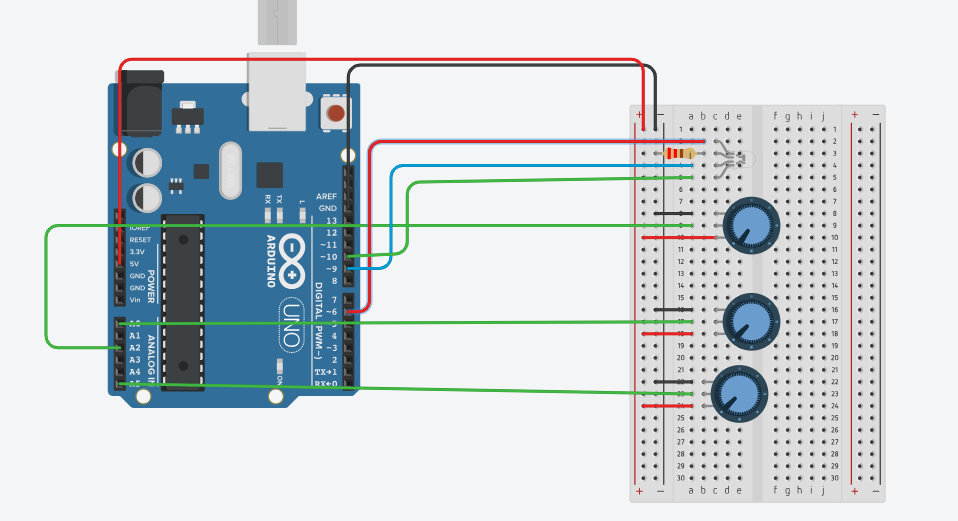

# Arduino Projects

Welcome to my **Arduino Projects** repository! Here, you will find a collection of exciting projects that demonstrate the capabilities of Arduino through practical electronics concepts. Each project includes its source code and detailed explanations to enhance your understanding of how it works.

## Getting Started

If you are new to Arduino, follow these steps to get started:

1. **Download the Arduino IDE**: You can download it [here](https://www.arduino.cc/en/software).
2. **Install Necessary Libraries**: Some projects may require additional libraries, which are specified in the project descriptions.

## Projects Overview

Below is a list of the Arduino projects included in this repository:

| Project                        | Description                                                          | Difficulty  |
|-------------------------------|----------------------------------------------------------------------|-------------|
| **LED_PWM**                   | Controls the brightness of an LED using Pulse Width Modulation (PWM). | Beginner    |
| **Control_LED_with_Button**   | Toggles an LED on or off using a button; the LED turns off when the button is pressed. | Beginner    |
| **Traffic_Light_Simulation**  | Simulates a traffic light using three LEDs (red, orange, green).     | Beginner    |
| **Reaction_Game**             | A fun game where a buzzer sounds at random intervals, and the player must press a button to stop the timer. | Intermediate |
| **LCD_Display**               | Displays custom text on a 16x2 LCD screen. | Beginner    |
| **LED_RGB_Potentiometers**    | Controls an RGB LED that changes color based on the position of three potentiometers. Each potentiometer adjusts the intensity of a specific color (red, green, blue). | Intermediate |
| **Ultrasonic_Buzzer**         | Uses an ultrasonic sensor to measure distance and activate a buzzer based on proximity. | Beginner    |
| **Servo_Door**                | Controls a servo motor to open or close a door based on the measured distance. | Beginner    |
| **Gas_and_Flame_Sensor**      | Monitors gas levels and flame presence, activating an alarm if necessary. | Intermediate |
| **LDR_LED_Control**           | Controls the brightness of an LED based on ambient light captured by an LDR. | Beginner    |
| **DHT_Temperature_Humidity**  | Measures and displays temperature and humidity using a DHT22 sensor on an LCD screen. | Intermediate |
| **Soil_Moisture_Control**     | Monitors soil moisture and activates a pump based on the measured moisture level. | Beginner |
| **LCD_Display**               | Displays "hello" on the first line and "2020" on the second line of an I2C LCD screen using the LiquidCrystal_I2C library. | Beginner      |
| **Gas_LED_Firebase**          | Monitors gas levels and controls an LED remotely using Firebase.    | Intermediate |


## Requirements

To run these projects, you will need:

- An Arduino board (Uno, Nano, or any compatible model)
- Sensors, actuators, and modules as specified in each project
- A breadboard, jumper wires, and other electronic components
- Arduino IDE ([download here](https://www.arduino.cc/en/software))

## How to Use

To set up and run the projects:

1. Clone or download this repository:
    ```bash
    git clone https://github.com/yourusername/Arduino.git
    ```
2. Open the Arduino IDE and load the `.ino` file from the desired project folder.
3. Connect your Arduino board to your computer and upload the code.
4. Follow the provided circuit diagrams to assemble the hardware.

## Wiring Diagram



## Contributions

Contributions are welcome! Feel free to submit new projects, report issues, or enhance existing ones. To contribute:

1. Fork this repository.
2. Create a new branch for your project or changes.
3. Submit a pull request for review.

---

Thank you for visiting! Feel free to explore, learn, and contribute to these projects. Happy tinkering!
